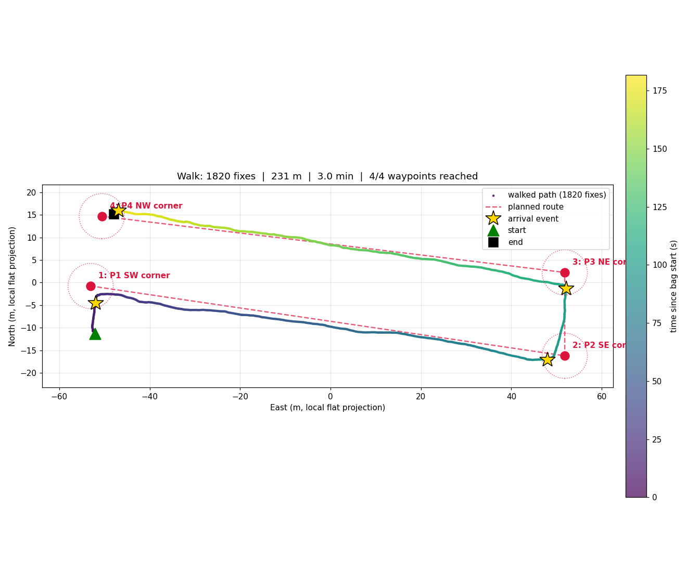

# Dragonfly — Localisation Walk-Test

Walk-test validation of the **Pixhawk 6C + ArduCopter EKF3 + MAVROS** localisation
pipeline for the Dragonfly drone build. A four-corner waypoint mission was walked
around a residential block in Melbourne on 2026-05-27 to confirm the fused global
state is usable for autonomous waypoint following before porting the same topics
to the rover platform.

**Headline results** (full writeup in [`report_localisation_section.md`](report_localisation_section.md)):

| Metric | Value |
|---|---|
| Waypoints reached | 4 / 4 |
| Closest approach per waypoint | 2.28 – 2.84 m |
| Total GPS path length | 231.3 m (95 % of 243 m planned) |
| Mission duration | 181.9 s |
| GPS satellites | avg 20.6 (multi-constellation) |



## Hardware

- Flight controller: Holybro Pixhawk 6C (ICM-42688-P + BMI088 IMUs, IST8310 mag, MS5611 baro)
- Firmware: ArduPilot ArduCopter 4.6.3 stable
- GNSS: u-blox NEO-M9N (GY-GPSV3) on GPS1 / Serial3, 230400 baud
- Host: Ubuntu 24.04, ROS 2 Jazzy, MAVROS 2.14
- USB bridge: SERIAL7 → `/dev/ttyACM3` (QGroundControl runs concurrently on SERIAL0)

## Repo contents

```
report_localisation_section.md     Thesis-style writeup of the pipeline and walk results
COMMANDS.md                        End-to-end runbook for reproducing the walk test
GPS_TEST_COMMANDS.md               GPS-only bring-up notes (pre-walk)

walk_to_waypoints.py               rclpy node — terminal navigator, /walking_test/status publisher
visualize_walk.py                  rosbag2 → trajectory plot (Figure 1 in the report)
analyze_walk.py                    Per-waypoint closest-approach + path-length summary
waypoints.yaml                     4-corner block route (lat/lon)
walk_raw.yaml                      Captured GPS samples used to derive waypoints
walk_plot.png                      Walk-derivation plot (pre-mission)

bags/
  walk_20260527_180048/            Short shakedown bag (.mcap + metadata)
  walk_20260527_180541/            Full mission bag (.mcap + metadata)
  walk_20260527_180541.png         Final trajectory figure

mav.parm                           Full ArduCopter parameter dump from the FC
mav.tlog / mav.tlog.raw            MAVLink telemetry log from the bring-up session
```

## Reproducing the walk

See [`COMMANDS.md`](COMMANDS.md) for the full runbook. Short version:

```bash
source /opt/ros/jazzy/setup.bash
# Terminal A — MAVROS bridge
ros2 launch mavros apm.launch fcu_url:=/dev/ttyACM3:115200
# Terminal B — record
ros2 bag record -o bags/walk_$(date +%Y%m%d_%H%M%S) \
  /mavros/global_position/global /mavros/global_position/compass_hdg \
  /mavros/global_position/raw/fix /mavros/local_position/pose \
  /mavros/imu/data_raw /walking_test/status
# Terminal C — navigator
python3 walk_to_waypoints.py
```

After the walk:

```bash
python3 visualize_walk.py bags/walk_YYYYMMDD_HHMMSS
python3 analyze_walk.py   bags/walk_YYYYMMDD_HHMMSS
```

## Next stage

Port the same MAVROS topics to a Raspberry Pi 4 on the rover platform and
replace the terminal navigator's text output with `/cmd_vel` publication into
the rover's motor driver for autonomous traversal of a fixed survey grid.
